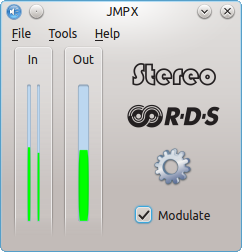

# JMPX v2
A Stereo encoder for FM transmitters now with [RDS], [SCA] and [DSCA] support.

This program can be used in conjunction with FM transmitters to produce stereo transmissions. This allows you to transmit your very own FM stereo signal which can be received with any standard FM stereo radio. The FM transmitter gets connected to the computer soundcard and JMPX takes care of the rest.

This program consists of a dynamically liked library and a GUI. The library performs the main work of obtaining audio and producing audio, and the GUI is just for control and looks. A soundcard that supports at least 96000Hz is needed for stereo operation and 192000Hz for RDS and/or SCA/DSCA operation.

## Acknowledgments

Thanks to Radio Galileo (Galileo Soc. Coop.) 100.5Mhz in Terni Italy and Federico Allegretti for their funding to the development of RDS support for JMPX.

## Compiling

Qt and Qt Creator are recommended (If on Windows I recommended using the MinGW compiler and getting everything with [MSYS2](http://www.msys2.org/).

* Open [JMPX.pro](JMPX.pro) with Qt Creator and build
* If on Windows copy [JMPX/libopus-1.2-alpha/bin/32/libopus-0.dll](JMPX/libopus-1.2-alpha/bin/32/libopus-0.dll) or [JMPX/libopus-1.2-alpha/bin/64/libopus-0.dll](JMPX/libopus-1.2-alpha/bin/64/libopus-0.dll) (depending if you are building a 32 bit or 64 bit version) to the build directory (alternatively you can build libopus yourself and copy the dll over).
* Run JMPX

Alternatively typing `qmake && make && sudo make install` in the head directory will compile and install JMPX assuming all the things JMPX needs to compile exists on your system

## FM Transmitter

The transmitter needs to not have any low pass filter on its input from the soundcard. This is so the frequencies above 16kHz actually modulate the transmitter.

For testing it is possible to use a simple one transistor FM transmitter design but signal quality and frequency stability are likely to be problems.

## SCA and DSCA

SCA is for transmitting another audio signal on top of the standard FM signal and is usually transmitted way up around 67.5K. DSCA is a digital equivalent to SCA and can be demodulated and decoded with [JDSCA].

Jonti 2017
http://jontio.zapto.org

[DSCA]: http://jontio.zapto.org/hda1/jdsca.html
[JDSCA]: https://github.com/jontio/JDSCA
[SCA]: https://en.wikipedia.org/wiki/Subsidiary_communications_authority
[RDS]: https://en.wikipedia.org/wiki/Radio_Data_System

